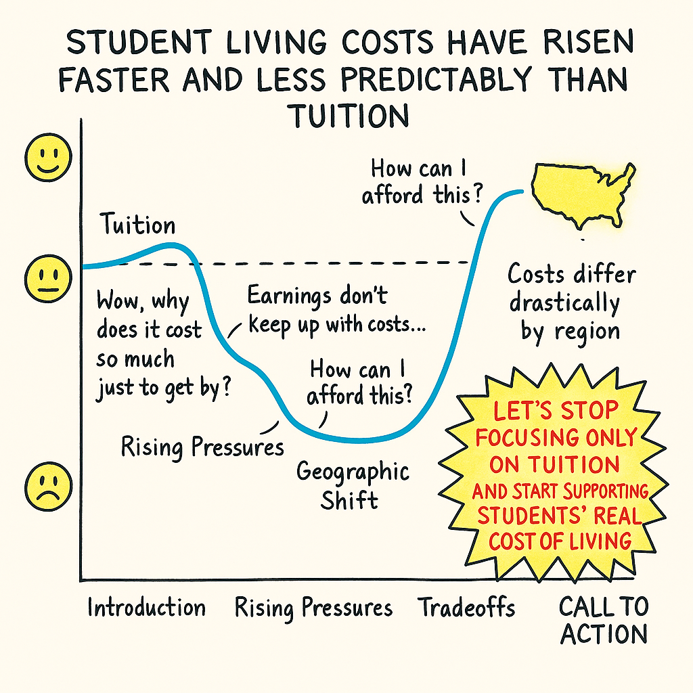
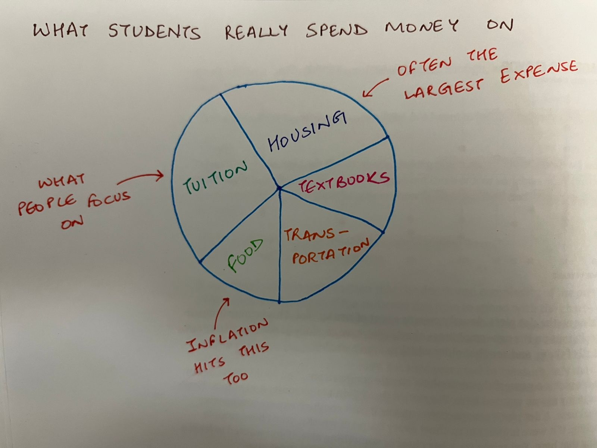

| [home page](https://hparmar2907.github.io/hparmar-dataviz-portfolio/) | [data viz examples](dataviz-examples) | [Visualizing Government Debt](visualizing-government-debt) | [critique by design](critique-by-design) | [final project I](final-project-part-one) | [final project II](final-project-part-two) | [final project III](final-project-part-three) |

# Outline
College affordability is often discussed strictly in terms of tuition, but the lived financial reality for students is shaped far more by everyday expenses—housing, food, textbooks, transportation, and part-time wages. My project aims to tell a clear, data-driven story about how the overall cost of being a college student has evolved over the past decade, and how those shifts quietly affect students’ choices, stress levels, and academic life.

Rather than creating a dashboard of disconnected charts, my goal is to build a narrative that helps the audience feel the financial pressure through the combination of numbers, comparisons, and human-centered design. The project will highlight which categories are rising fastest, where regional differences matter, and how student earnings have not kept pace. Ultimately, this story is meant to help students, families, and educators understand where the real strain lies—and why it matters.

## Storyline
Student living costs have risen faster and less predictably than tuition, creating financial pressure that most people do not see.

## User Stories
- As a current student, I want to understand why my cost of living feels so high, so that I can make informed decisions about work, housing, and budgeting.

- As a prospective student or parent, I want to know what expenses to expect beyond tuition so that I’m not surprised later.

- As a university staff member, I want to see which categories strain students the most so that campus support programs can be better designed.

## Story Arc
The following story arc illustrates the emotional and analytical progression of my project. It shows how students’ experiences move from initial awareness of tuition to rising pressure from living costs, the low point of affordability struggles, and ultimately toward a clearer understanding of the real drivers behind student financial stress - ending in a call to action.

## Initial sketches
---

## Sketch 1: Introduction — What Students Really Spend Money On

This sketch introduces the idea that student expenses extend far beyond tuition. Although tuition 
is the most publicly discussed cost, students face several everyday financial pressures that often 
add up to a much larger burden—housing, food, textbooks, and transportation. This hand-drawn pie 
chart captures the full picture of where student money goes, emphasizing that tuition is only one 
slice of a much larger cost structure.

  

**Figure 1.** Hand-drawn pie chart showing the breakdown of student expenses, with annotations highlighting 
how housing, food, inflation, and other essentials contribute significantly to the total cost of being a student.

---

# The data
To support the story behind my project, I identified several public, credible, and well-structured data sources that together capture the true cost of being a college student in the United States. These datasets come from national statistical agencies and higher-education research organizations, ensuring reliability and long-term consistency. All of the data I am using is fully publicly accessible, and copies are included in my GitHub repository for transparency and reproducibility.

The first major dataset I am using is the College Board’s Trends in College Pricing report, which provides annual data on tuition, fees, room and board, and cost-of-attendance components across different types of institutions (public/private, two-year/four-year). This dataset is released each year and includes historical trends, inflation-adjusted pricing, and national averages. I will use this data to establish the difference between sticker tuition and the actual cost of attending college, and to highlight how housing and other non-tuition components contribute to total student expenses.
I downloaded the 2025 Excel dataset and have included a copy in my GitHub folder for reference.

The second source is the Bureau of Labor Statistics (BLS) Consumer Price Index (CPI), which publishes monthly and annual inflation data for specific expenditure categories. The CPI includes categories that are directly relevant to students—such as rent, food at home, food away from home, and educational books/supplies (used as a proxy for textbook inflation). I will use these indices to compare the rate of increase in everyday student living costs relative to overall inflation and relative to tuition trends. This helps support the “Rising Pressures” section of my analysis.

My third source is the National Center for Education Statistics (NCES), which provides survey-based data on student employment, average wages, financial aid, and enrollment patterns. These data will allow me to analyze how much students typically earn, how many hours they work, and how their ability to offset costs has changed over time. This directly supports the “Tradeoff Zone” section of my story, where I show how students cope with rising costs.

All of these datasets are publicly available and can be accessed online. Copies of the primary data files I am using are also stored in my GitHub directory for easy reference.

Publicly accessible sources:

College Board Trends in College Pricing:
<https://research.collegeboard.org/trends/college-pricing>

Bureau of Labor Statistics CPI database:
<https://www.bls.gov/cpi/>

National Center for Education Statistics (NCES):
<https://nces.ed.gov/>

# Method and medium
For my final project, I plan to create an interactive, scroll-based story using Shorthand, paired with data visualizations built in Tableau. Shorthand will allow me to structure the narrative according to my story arc, integrate text, sketches, and visuals, and guide the reader through the emotional progression of the project. Tableau will be used to produce all charts, maps, and comparative graphics—ensuring they are clean, interactive, and consistent with the course tools. My final deliverable will be a standalone digital story that combines narrative, visualization, and user-friendly design, fully aligning with the class requirement for an interactive and accessible format.

## References
College Board. Trends in College Pricing and Student Aid. Retrieved from: <https://research.collegeboard.org/trends/college-pricing>

U.S. Bureau of Labor Statistics. Consumer Price Index (CPI). Retrieved from: <https://www.bls.gov/cpi/>

National Center for Education Statistics (NCES). Student Characteristics, Employment, and Cost of Attendance Data. Retrieved from: <https://nces.ed.gov/>

Few, Stephen. Data Visualization Effectiveness Profile and related principles discussed in class.

Good Charts (Class Textbook). Story structure concepts from Chapter 8.

## AI acknowledgements
I used AI to support portions of this assignment in accordance with course guidelines. Specifically, I used it to help refine the wording, improve clarity, and format sections such as the outline, data description, and method/medium narrative. I also used AI to generate draft language that I revised, and to assist with structuring markdown formatting for my portfolio. All decisions about content, data sources, project direction, visual design, and analysis were made by me, and AI assistance was limited to editing support and idea organization.
