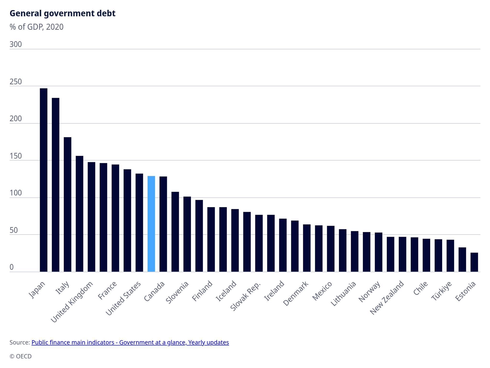

| [home page](https://hparmar2907.github.io/hparmar-dataviz-portfolio/) | [data viz examples](dataviz-examples) | [Visualizing Government Debt](visualizing-government-debt) | [critique by design](critique-by-design) | [final project I](final-project-part-one) | [final project II](final-project-part-two) | [final project III](final-project-part-three) |

## Chart: General Government Debt (% of GDP, 2020)

The chart below, sourced from the OECD, illustrates the percentage of general government debt as a share of GDP for various countries in 2020.  
Japan and Italy show the highest debt levels (over 150% of GDP), while countries such as Estonia, Chile, and Türkiye have relatively low debt ratios.  
The United States and Canada fall near the middle, indicating moderate debt levels compared to other major economies.

**Source:** [OECD - Public finance main indicators: Government at a glance, Yearly updates](https://data.oecd.org/gga/general-government-debt.htm)

<noscript></noscript><object class='tableauViz'  style='display:none;'><param name='host_url' value='https%3A%2F%2Fpublic.tableau.com%2F' /> <param name='embed_code_version' value='3' /> <param name='site_root' value='' /><param name='name' value='VisualizingGovernmentDebt_17621225982940&#47;Sheet1' /><param name='tabs' value='no' /><param name='toolbar' value='yes' /><param name='static_image' value='https:&#47;&#47;public.tableau.com&#47;static&#47;images&#47;Vi&#47;VisualizingGovernmentDebt_17621225982940&#47;Sheet1&#47;1.png' /> <param name='animate_transition' value='yes' /><param name='display_static_image' value='yes' /><param name='display_spinner' value='yes' /><param name='display_overlay' value='yes' /><param name='display_count' value='yes' /><param name='language' value='en-US' /><param name='filter' value='publish=yes' /></object>
 

